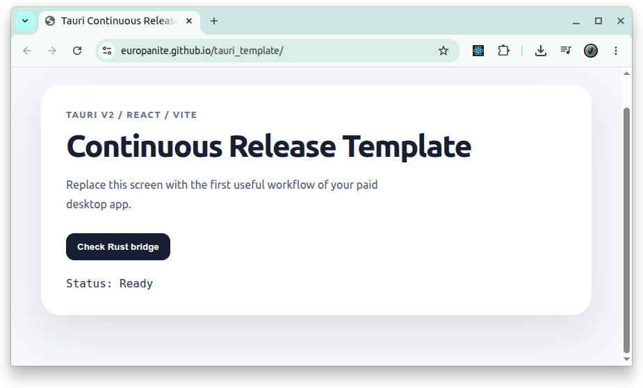

# [Tauri Template](https://github.com/europanite/tauri_template "Tauri Template")

[](https://opensource.org/licenses/Apache-2.0)


[](https://github.com/europanite/tauri_template/actions/workflows/ci.yml)
[](https://github.com/europanite/tauri_template/actions/workflows/pages.yml)
[](https://github.com/europanite/tauri_template/actions/workflows/tauri.yml)



A minimal template for building, validating, and releasing paid desktop applications continuously.

This template uses **Tauri v2 + Vite + React + TypeScript**. 

## Initial setup

```bash
npm install
npm run tauri dev
```

## Local validation

```bash
npm run check
npm run build
npm run tauri build
```

Or run the bundled release check script:

```bash
bash scripts/release-check.sh
```

## Create a new app from this template

```bash
bash scripts/set-app-meta.sh \
  "tauri_template" \
  "com.example.tauri_template" \
  "0.1.0"
```

Arguments:

1. `productName`
2. `identifier`
3. `version`

Then edit these files:

- `docs/APP_SPEC.md`
- `src/App.tsx`
- `src-tauri/src/lib.rs`
- `README.md`

## CI

The standard validation workflow runs on `push` and `pull_request`.

```bash
npm run check
cargo test --manifest-path src-tauri/Cargo.toml
```

```bash
$env:Path = "C:\Program Files\nodejs;$env:USERPROFILE\.cargo\bin;$env:Path"

cd C:\Users\miked\anime_tag_vault

npm.cmd exec -- tauri info
npm.cmd exec -- tauri build
```

## Release

Push a tag such as `v0.1.0` to create a GitHub Release draft and upload artifacts for each OS.

```bash
git tag v0.1.0
git push origin v0.1.0
```

You can also run the release workflow manually:

1. Open GitHub Actions.
2. Select the `release` workflow.
3. Click `Run workflow`.
